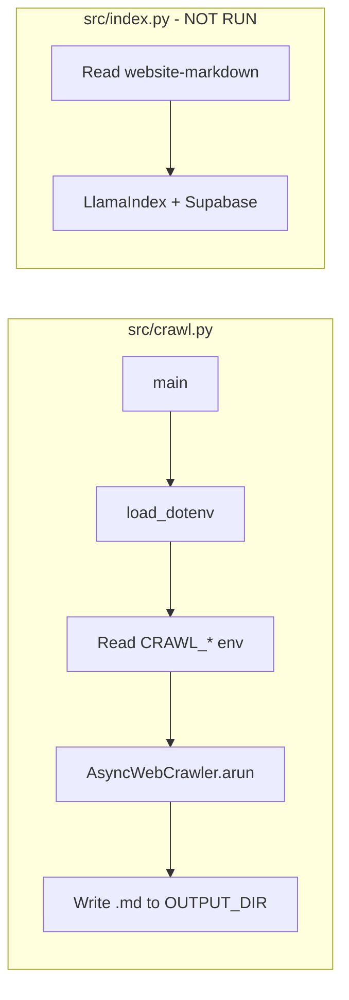

# Crawl Integration Test Plan

## Scope

The test will:

- Run the full crawl pipeline (Crawl4AI, real network calls)
- Use `CRAWL_URL`, `CRAWL_MAX_DEPTH`, `CRAWL_MAX_PAGES` from [.env](.env)
- Write output to an isolated temp directory (not `website-markdown/`)
- Assert that at least one `.md` file was written with non-empty content
- **Not** touch [src/index.py](src/index.py), LlamaIndex, or Supabase

## Current Structure




The crawl script uses a hardcoded `OUTPUT_DIR = "website-markdown"` (line 24). To isolate the test, we need the output directory to be configurable.

## Implementation Steps

### 1. Make output directory configurable in crawl.py

Add support for `CRAWL_OUTPUT_DIR` environment variable in [src/crawl.py](src/crawl.py):

- After `OUTPUT_DIR = "website-markdown"` (line 24), use: `output_dir = os.environ.get("CRAWL_OUTPUT_DIR", OUTPUT_DIR)`
- Use `output_dir` instead of `OUTPUT_DIR` when building `output_path` (line 78)

This keeps backward compatibility (default unchanged) and allows tests to override via env.

### 2. Add pytest dependencies

Add to [requirements.txt](requirements.txt):

- `pytest`
- `pytest-asyncio`

### 3. Add pytest configuration

Create `pyproject.toml` or `pytest.ini` at project root with:

- `pytest-asyncio` mode = `auto` (so async tests work without decorators)
- Optional: `asyncio_mode = auto` in `[tool.pytest.ini_options]` if using pyproject.toml

### 4. Create the integration test

Create `tests/integration/test_crawl.py` (or `tests/test_crawl_integration.py`):

**Test flow:**

1. Create a temporary directory via `tmp_path` (pytest fixture)
2. Set `CRAWL_OUTPUT_DIR` to `tmp_path` (via `monkeypatch` or `os.environ` before import)
3. Ensure `.env` is loaded (crawl's `main()` calls `load_dotenv()`; run from project root so it finds `.env`)
4. Run `asyncio.run(main())` (or call the crawl module's main)
5. Assert: `list(tmp_path.glob("*.md"))` has length >= 1
6. Assert: at least one file has non-empty content (e.g. `len(content) > 100`)

**Important:** Set `CRAWL_OUTPUT_DIR` before the crawl module reads it. Since `main()` reads `os.environ` at runtime, patching `os.environ["CRAWL_OUTPUT_DIR"]` at the start of the test (before calling `main()`) will work. No need to patch the constant.

**Async:** Use `@pytest.mark.asyncio` and `async def test_...` or call `asyncio.run(main())` from a sync test.

### 5. Document and optionally skip when .env is missing

- Add a `pytest.importorskip` or check for `CRAWL_URL` at test start; skip with a clear message if `.env` is not configured (e.g. in CI without secrets)
- Update [README.md](README.md) with: `pytest tests/` or `pytest tests/integration/ -v` and note that the crawl integration test requires `.env` with `CRAWL_URL`

## File Summary


| File                                 | Action                                 |
| ------------------------------------ | -------------------------------------- |
| [src/crawl.py](src/crawl.py) | Add `CRAWL_OUTPUT_DIR` env var support |
| [requirements.txt](requirements.txt) | Add pytest, pytest-asyncio             |
| `pyproject.toml` or `pytest.ini`     | Add pytest-asyncio config              |
| `tests/integration/test_crawl.py`    | New integration test                   |
| [README.md](README.md)               | Document how to run tests              |


## Test Execution

```bash
# From project root (so .env is found)
pytest tests/integration/test_crawl.py -v
```

**Note:** This test performs real HTTP requests to `CRAWL_URL`. With `CRAWL_MAX_PAGES=30` and `CRAWL_MAX_DEPTH=2`, it may take 30–60+ seconds. Consider adding a faster variant (e.g. `CRAWL_MAX_PAGES=2` via env override in test) if desired, or document the expected duration.