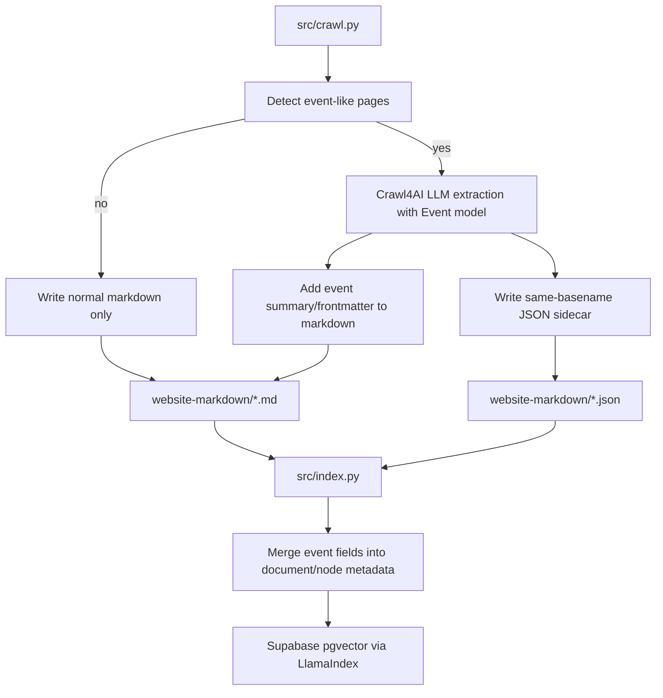

# Event Parsing Plan

## Goal

Implement the `Parsing "Event" Models` portion of [the project overview](/Users/peabody/Documents/repos/library_bot_poc/library_bot_poc/.cursor/commands/project-overview.md) by defining a Pydantic event schema, using Crawl4AI LLM extraction on event-like pages, and making the extracted fields available to both RAG retrieval and future structured event responses.

## Proposed Flow

## Implementation Areas

### 1. Add a canonical event schema

Create a shared Pydantic model module, likely under [src/](/Users/peabody/Documents/repos/library_bot_poc/library_bot_poc/scripts), that defines the event fields from [project-overview.md](/Users/peabody/Documents/repos/library_bot_poc/library_bot_poc/.cursor/commands/project-overview.md): `event_type`, `event_title`, `date_time`, `target_age_group`, `location`, `description`, and `link_to_details`.

Use `Field(..., description=...)` so the schema is helpful both for Crawl4AI extraction and for any later structured response generation.

### 2. Extend crawl-time extraction in [src/crawl.py](/Users/peabody/Documents/repos/library_bot_poc/library_bot_poc/src/crawl.py)

Keep [src/crawl.py](/Users/peabody/Documents/repos/library_bot_poc/library_bot_poc/src/crawl.py) as the main integration point because it already owns Crawl4AI config, page results, file naming, and output writing.

Plan for this file:

- Add event-page heuristics based on URL/title/text cues such as `event`, `calendar`, `program`, `storytime`, `book club`, and similar library terms.
- For event-like pages only, run Crawl4AI LLM extraction using the new Pydantic schema and the existing OpenAI credentials pattern described in the [Crawl4AI LLM extraction docs](https://docs.crawl4ai.com/extraction/llm-strategies/).
- Persist two outputs for successful event extraction:
  - same-basename markdown enriched with structured event text or frontmatter for RAG
  - same-basename JSON sidecar containing normalized event records
- Keep non-event pages on the current markdown-only path.
- Update output cleanup so stale `.json` sidecars are removed when crawl output is cleared.

### 3. Make indexing event-aware in [src/index.py](/Users/peabody/Documents/repos/library_bot_poc/library_bot_poc/src/index.py)

Update the markdown ingestion path so `file.md` can be paired with `file.json` when present.

Preferred approach:

- Load markdown as the primary document text.
- If a same-basename JSON sidecar exists, merge normalized event fields into document metadata before markdown parsing/chunking.
- Preserve those metadata keys through `chunk_nodes_for_embeddings()` so each resulting `TextNode` can still be filtered or inspected later.
- Avoid indexing raw JSON as separate standalone documents; use metadata plus markdown-friendly text instead.

### 4. Prepare query-time use of event metadata

Keep the first implementation centered on extraction and indexing, but leave a clean seam for later event-specific retrieval in [src/query.py](/Users/peabody/Documents/repos/library_bot_poc/library_bot_poc/src/query.py).

The plan does not require a full event-specific answer formatter yet, but it should preserve enough metadata that later work can detect questions like "kids events" and filter or structure results without re-crawling.

### 5. Config and docs

Update supporting docs/config so the behavior is discoverable:

- [.env.example](/Users/peabody/Documents/repos/library_bot_poc/library_bot_poc/.env.example): any new crawl/extraction toggles if needed
- [README.md](/Users/peabody/Documents/repos/library_bot_poc/library_bot_poc/README.md): how event extraction works, what gets written, and any OpenAI cost/runtime caveats
- Optionally align the event schema description in [project-overview.md](/Users/peabody/Documents/repos/library_bot_poc/library_bot_poc/.cursor/commands/project-overview.md) with the exact implementation module name if helpful

### 6. Tests

Add focused coverage for the new behavior.

Recommended test areas:

- event-page heuristic matches expected library event pages and skips non-event pages
- extracted event data normalizes into the Pydantic schema
- crawl output writes both `.md` and `.json` for event-like pages
- crawl cleanup removes stale sidecars
- index loading merges sidecar event metadata into documents/nodes without breaking non-event markdown ingestion

## Key Files

- [project overview](/Users/peabody/Documents/repos/library_bot_poc/library_bot_poc/.cursor/commands/project-overview.md)
- [crawl skill](/Users/peabody/Documents/repos/library_bot_poc/library_bot_poc/.cursor/skills/crawl4ai-skill/SKILL.md)
- [src/crawl.py](/Users/peabody/Documents/repos/library_bot_poc/library_bot_poc/src/crawl.py)
- [src/index.py](/Users/peabody/Documents/repos/library_bot_poc/library_bot_poc/src/index.py)
- [src/query.py](/Users/peabody/Documents/repos/library_bot_poc/library_bot_poc/src/query.py)
- [README.md](/Users/peabody/Documents/repos/library_bot_poc/library_bot_poc/README.md)
- [.env.example](/Users/peabody/Documents/repos/library_bot_poc/library_bot_poc/.env.example)

## Suggested Defaults

- Use the existing OpenAI-backed Crawl4AI LLM extraction path.
- Start with conservative event-page heuristics to control cost.
- Store one JSON sidecar per source page using the same basename as the markdown file.
- Keep markdown as the main indexed text, with sidecar data merged into metadata rather than indexed as raw JSON documents.

