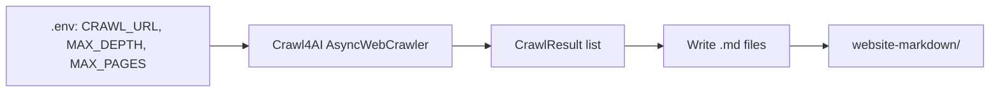

# Plan 1: Implement Crawling

## Scope

Build the crawling pipeline that:

1. Reads the home-page URL from an environment variable
2. Crawls/scrapes the site using Crawl4AI with `max_depth` and `max_pages` from env
3. Saves each page's markdown to the `website-markdown/` folder

## Architecture




## Implementation Steps

### 1. Project Setup (crawling scope only)

- **Dependencies** (`[requirements.txt](requirements.txt)`): `crawl4ai`, `python-dotenv`
- **Configuration** (`.env.example`):

```
  CRAWL_URL=https://example.com
  CRAWL_MAX_DEPTH=2
  CRAWL_MAX_PAGES=30
  

```

- **Output folder**: `website-markdown/` (create if missing; add to `.gitignore` if desired)

### 2. Crawler Script

Create `scripts/crawl.py` (or `src/crawler.py` with a `__main__` block) that:

**Step 1 – Load config from env:**

```python
import os
from dotenv import load_dotenv
load_dotenv()

url = os.environ["CRAWL_URL"]
max_depth = int(os.environ.get("CRAWL_MAX_DEPTH", 2))
max_pages = int(os.environ.get("CRAWL_MAX_PAGES", 30))
```

**Step 2 – Crawl with Crawl4AI** (per [crawl4ai-skill](skills/crawl4ai-skill/SKILL.md) and [examples](skills/crawl4ai-skill/examples.md)):

- Use `AsyncWebCrawler` with `CrawlerRunConfig`
- Use `BFSDeepCrawlStrategy` or `DFSDeepCrawlStrategy` with `max_depth`, `max_pages`, `include_external=False`
- Use `LXMLWebScrapingStrategy()` for scraping
- Call `crawler.arun(url, config=config)`; deep crawls return a **list** of `CrawlResult`
- Extract markdown from each result: `result.markdown` (or `result.markdown.raw_markdown` if it's a `MarkdownGenerationResult`)

**Step 3 – Write markdown to `website-markdown/`:**

- Ensure `website-markdown/` exists (`os.makedirs(..., exist_ok=True)`)
- For each `CrawlResult`: derive a safe filename from the URL (e.g. slug or hash) and write the markdown to `website-markdown/{slug}.md`
- Handle `result.markdown` being either `str` or `MarkdownGenerationResult` (use `raw_markdown` when applicable)

### 3. File Naming

- Convert URL to a safe filename: e.g. `https://example.com/docs/guide` → `example_com_docs_guide.md` or use `hashlib` for a short hash
- Avoid collisions (e.g. append index if needed)

### 4. Error Handling

- Validate `CRAWL_URL` is set before crawling
- Skip or log failed results (`result.success == False`)
- Log progress (e.g. pages crawled, files written)

## Key Files


| File                | Purpose                                            |
| ------------------- | -------------------------------------------------- |
| `scripts/crawl.py`  | Entry point: load env, run crawler, write markdown |
| `requirements.txt`  | `crawl4ai`, `python-dotenv`                        |
| `.env.example`      | `CRAWL_URL`, `CRAWL_MAX_DEPTH`, `CRAWL_MAX_PAGES`  |
| `website-markdown/` | Output directory for `.md` files                   |


## Reference

- [crawl4ai-skill SKILL.md](skills/crawl4ai-skill/SKILL.md) – CrawlerRunConfig, strategies, CrawlResult
- [crawl4ai-skill examples.md](skills/crawl4ai-skill/examples.md) – BFS/DFS deep crawl examples

