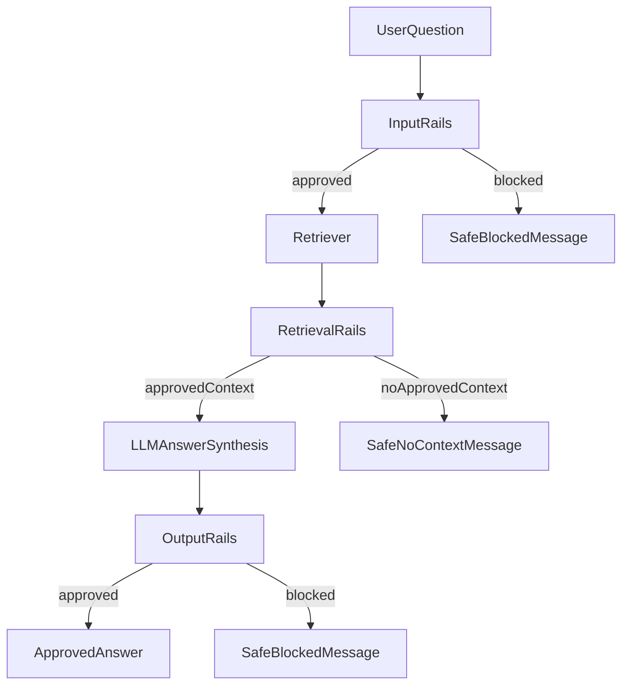

# Add NeMo Guardrails To RAG Flow

## Goal

Add input guardrails for user questions, retrieval guardrails for RAG context, and output guardrails for model responses without changing the crawl/index pipeline.

## Current Integration Points

The current query path is concentrated in [scripts/query.py](/Users/peabody/Documents/repos/library_bot_poc/library_bot_poc/scripts/query.py), where `run_query()` trims the user question and then immediately calls `engine.query(normalized_query)`. That single call currently performs both retrieval and answer generation, which means there is no clean interception point for retrieval guardrails.

The primary UI entrypoint is [streamlit_app.py](/Users/peabody/Documents/repos/library_bot_poc/library_bot_poc/streamlit_app.py), which calls `run_query(prompt, query_engine=query_engine)` and then renders both `str(response)` and `extract_sources(response)`.

## Proposed Architecture

Introduce a shared guardrailed pipeline module, likely [scripts/guardrails.py](/Users/peabody/Documents/repos/library_bot_poc/library_bot_poc/scripts/guardrails.py) plus a guardrail config directory such as [guardrails/](/Users/peabody/Documents/repos/library_bot_poc/library_bot_poc/guardrails/), and refactor querying into explicit phases:

```python
validated_question = apply_input_rails(question)
retrieved_nodes = retrieve_nodes(validated_question)
approved_nodes = apply_retrieval_rails(validated_question, retrieved_nodes)
answer_text = synthesize_answer(validated_question, approved_nodes)
approved_answer = apply_output_rails(validated_question, approved_nodes, answer_text)
```

A small shared result object should carry:

- approved user question
- final answer text
- filtered source nodes or formatted source dicts
- block status and user-facing fallback message

This shared pipeline should be used by both [streamlit_app.py](/Users/peabody/Documents/repos/library_bot_poc/library_bot_poc/streamlit_app.py) and [scripts/query.py](/Users/peabody/Documents/repos/library_bot_poc/library_bot_poc/scripts/query.py) so the CLI and UI stay behaviorally aligned.

## Implementation Steps

### 1. Add NeMo Guardrails dependency and config surface

Update [requirements.txt](/Users/peabody/Documents/repos/library_bot_poc/library_bot_poc/requirements.txt) to include NeMo Guardrails and any chosen LLM provider extras.

Extend [.env.example](/Users/peabody/Documents/repos/library_bot_poc/library_bot_poc/.env.example) with guardrail-related settings such as:

- `GUARDRAILS_CONFIG_DIR`
- `GUARDRAILS_ENABLED`
- optional provider settings if NeMo Guardrails uses a separate model endpoint from the existing OpenAI query model

Document the new setup and runtime flow in [README.md](/Users/peabody/Documents/repos/library_bot_poc/library_bot_poc/README.md).

### 2. Create NeMo Guardrails configuration files

Add a dedicated guardrail config folder, for example [guardrails/](/Users/peabody/Documents/repos/library_bot_poc/library_bot_poc/guardrails/), containing:

- `config.yml` for model and rail wiring
- `rails/input.co` for unsafe/off-topic user-question checks
- `rails/output.co` for unsafe or policy-violating answer checks
- optional `actions.py` for project-specific checks
- optional `kb/` files if you decide to use documentation-backed topic grounding inside rails

Initial policy scope should stay narrow and testable:

- block empty, malicious, or obviously unsafe questions
- block questions clearly unrelated to the crawled library website content
- reject retrieved chunks that are empty, malformed, or clearly outside expected site/topic boundaries
- block answers that contain unsafe or disallowed content

### 3. Refactor retrieval and synthesis in query code

Refactor [scripts/query.py](/Users/peabody/Documents/repos/library_bot_poc/library_bot_poc/scripts/query.py) so retrieval and answer generation are separate operations instead of a single `engine.query(...)` call.

Concretely:

- keep `build_query_engine()` or replace it with helpers that expose a retriever and response synthesizer separately
- add a retrieval helper that returns source nodes before synthesis
- add a synthesis helper that generates the final answer from the approved question plus approved nodes
- preserve `extract_sources()` so the Streamlit app can continue rendering sources with minimal UI changes

Keep [scripts/rag.py](/Users/peabody/Documents/repos/library_bot_poc/library_bot_poc/scripts/rag.py) as the place for shared LlamaIndex model/vector-store configuration, but consider adding helper constructors there if that keeps `query.py` smaller.

### 4. Add a shared guardrailed pipeline

Create a shared orchestration layer, preferably [scripts/guardrails.py](/Users/peabody/Documents/repos/library_bot_poc/library_bot_poc/scripts/guardrails.py), responsible for:

- loading `RailsConfig` and `LLMRails`
- applying input rails to the raw user question
- applying retrieval validation to retrieved nodes before synthesis
- applying output rails to the synthesized answer
- returning a structured success or blocked result

Keep this module independent from Streamlit so it can also be exercised by unit tests and the CLI path.

Recommended default behavior:

- if input rails block, skip retrieval and return a safe user-facing message
- if retrieval rails filter out all context, return a safe "no approved context" response rather than forcing generation
- if output rails block, return a safe fallback answer and do not expose the blocked raw answer in the UI

### 5. Integrate the shared pipeline into the UI and CLI

Update [streamlit_app.py](/Users/peabody/Documents/repos/library_bot_poc/library_bot_poc/streamlit_app.py) to call the new shared guardrailed pipeline instead of calling `run_query()` directly.

Update [scripts/query.py](/Users/peabody/Documents/repos/library_bot_poc/library_bot_poc/scripts/query.py) CLI `main()` to use the same pipeline so `QUERY_TEXT` follows the same guardrail behavior as the UI.

Preserve the existing user experience where possible:

- still show approved source snippets in Streamlit
- replace raw exceptions with friendly blocked/failure messages
- keep the current chat transcript structure in `st.session_state.messages`

### 6. Add tests for each guardrail stage

Extend [tests/test_query.py](/Users/peabody/Documents/repos/library_bot_poc/library_bot_poc/tests/test_query.py) with fast unit tests for:

- blocked input question
- allowed input question
- retrieval filtering that removes some nodes
- retrieval filtering that removes all nodes
- blocked output answer
- allowed output answer
- CLI behavior when guardrails block

Add dedicated tests for the new shared guardrail module if introduced, for example [tests/test_guardrails.py](/Users/peabody/Documents/repos/library_bot_poc/library_bot_poc/tests/test_guardrails.py).

Follow the current testing style in [tests/test_query.py](/Users/peabody/Documents/repos/library_bot_poc/library_bot_poc/tests/test_query.py): monkeypatch collaborators, use small fake response objects, and assert on returned text plus control flow.

## Suggested File Change Set

Likely new or changed files:

- [requirements.txt](/Users/peabody/Documents/repos/library_bot_poc/library_bot_poc/requirements.txt)
- [.env.example](/Users/peabody/Documents/repos/library_bot_poc/library_bot_poc/.env.example)
- [README.md](/Users/peabody/Documents/repos/library_bot_poc/library_bot_poc/README.md)
- [scripts/query.py](/Users/peabody/Documents/repos/library_bot_poc/library_bot_poc/scripts/query.py)
- [scripts/rag.py](/Users/peabody/Documents/repos/library_bot_poc/library_bot_poc/scripts/rag.py)
- [streamlit_app.py](/Users/peabody/Documents/repos/library_bot_poc/library_bot_poc/streamlit_app.py)
- [scripts/guardrails.py](/Users/peabody/Documents/repos/library_bot_poc/library_bot_poc/scripts/guardrails.py)
- [guardrails/config.yml](/Users/peabody/Documents/repos/library_bot_poc/library_bot_poc/guardrails/config.yml)
- [guardrails/rails/input.co](/Users/peabody/Documents/repos/library_bot_poc/library_bot_poc/guardrails/rails/input.co)
- [guardrails/rails/output.co](/Users/peabody/Documents/repos/library_bot_poc/library_bot_poc/guardrails/rails/output.co)
- [guardrails/actions.py](/Users/peabody/Documents/repos/library_bot_poc/library_bot_poc/guardrails/actions.py)
- [tests/test_guardrails.py](/Users/peabody/Documents/repos/library_bot_poc/library_bot_poc/tests/test_guardrails.py)

## Data Flow




## Risks And Notes

- Retrieval guardrails require a query refactor because the current `engine.query(...)` call hides retrieval and synthesis inside one step.
- The current Streamlit UI stores chat history only for display, not for true multi-turn reasoning, so initial guardrails should be scoped to single-turn behavior.
- Avoid showing raw blocked answers or raw unsafe source excerpts in the UI.
- Keep the first version simple: input rails, basic retrieval validation/filtering, and output rails. More advanced dialog rails can come later.

