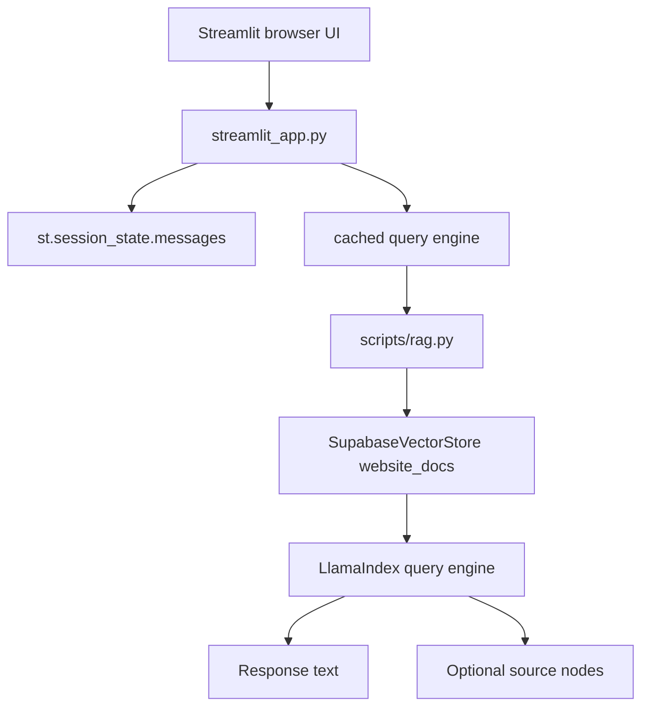

# Add Streamlit Query UI

## Goal

Replace the hard-coded `QUERY_TEXT` flow with a simple local Streamlit interface that accepts a question from the user and displays the answer from the existing RAG pipeline.

## Recommended Approach

Build a single-file Streamlit app, likely `[/Users/peabody/Documents/repos/library_bot_poc/library_bot_poc/streamlit_app.py](/Users/peabody/Documents/repos/library_bot_poc/library_bot_poc/streamlit_app.py)`, and have it call the shared helpers in `[/Users/peabody/Documents/repos/library_bot_poc/library_bot_poc/scripts/rag.py](/Users/peabody/Documents/repos/library_bot_poc/library_bot_poc/scripts/rag.py)` directly.

Do not make the UI shell out to `[/Users/peabody/Documents/repos/library_bot_poc/library_bot_poc/scripts/query.py](/Users/peabody/Documents/repos/library_bot_poc/library_bot_poc/scripts/query.py)` or keep depending on `QUERY_TEXT`. That script is CLI-oriented and prints to stdout; the UI should instead own user input and render the result itself.

## Steps

### 1. Add Streamlit dependency

Update `[/Users/peabody/Documents/repos/library_bot_poc/library_bot_poc/requirements.txt](/Users/peabody/Documents/repos/library_bot_poc/library_bot_poc/requirements.txt)` to include `streamlit`.

### 2. Extract one reusable query helper

Refactor the query logic so the core behavior is callable from both CLI and UI.

Best shape:

- keep `[/Users/peabody/Documents/repos/library_bot_poc/library_bot_poc/scripts/query.py](/Users/peabody/Documents/repos/library_bot_poc/library_bot_poc/scripts/query.py)` as the terminal entrypoint
- add a reusable helper such as `build_query_engine()` or `run_query(query_text: str)` in either `[/Users/peabody/Documents/repos/library_bot_poc/library_bot_poc/scripts/query.py](/Users/peabody/Documents/repos/library_bot_poc/library_bot_poc/scripts/query.py)` or `[/Users/peabody/Documents/repos/library_bot_poc/library_bot_poc/scripts/rag.py](/Users/peabody/Documents/repos/library_bot_poc/library_bot_poc/scripts/rag.py)`

That helper should:

- load/configure LlamaIndex for query-time use
- reconnect to the existing Supabase-backed index
- build a query engine with the current `similarity_top_k`
- return the response object or response text for a given user question

### 3. Build the first Streamlit app

Create `[/Users/peabody/Documents/repos/library_bot_poc/library_bot_poc/streamlit_app.py](/Users/peabody/Documents/repos/library_bot_poc/library_bot_poc/streamlit_app.py)` using the Streamlit chatbot pattern from Example 6.

Recommended UI shape:

- `st.title()` and a short caption
- initialize `st.session_state.messages`
- render prior messages with `st.chat_message()`
- accept user text with `st.chat_input()`
- append the user message to session state
- call the reusable query helper
- append and render the assistant answer

For a first pass, keep the backend stateless per turn even if the UI looks like a chat. That matches the project’s current single-question query design.

### 4. Cache expensive backend setup

Use `st.cache_resource` for the expensive, reusable backend objects such as the vector-store-backed index or query engine.

This matters because Streamlit reruns the script on every interaction. Without caching, the app will reconnect and rebuild more often than necessary.

### 5. Replace env-driven question input

Remove `QUERY_TEXT` from the primary user workflow.

Recommended behavior:

- keep `DATABASE_URL` and `OPENAI_API_KEY` in `.env`
- stop requiring `QUERY_TEXT` for the UI path
- optionally keep `QUERY_TEXT` support in the CLI script for debugging or terminal use

This gives you a browser-based UX while preserving a simple non-UI fallback.

### 6. Improve UX with error handling

Translate current CLI-style failures into Streamlit UI messages.

Examples:

- missing `DATABASE_URL` or `OPENAI_API_KEY` -> `st.error()` plus `st.stop()`
- query/index load failure -> show a friendly error instead of raising raw exceptions
- empty question -> ignore or show a lightweight prompt to enter text

### 7. Optionally show retrieved sources

A strong first UX improvement is to surface source context from the response object, such as `response.source_nodes`, in an expander or secondary section.

This is optional for the first cut, but it is a natural RAG feature and helps users trust the answer.

### 8. Document how to run the app

Update `[/Users/peabody/Documents/repos/library_bot_poc/library_bot_poc/README.md](/Users/peabody/Documents/repos/library_bot_poc/library_bot_poc/README.md)` to include:

- install step for `streamlit`
- run command like `streamlit run streamlit_app.py`
- required env vars
- expected workflow: crawl -> index -> launch UI -> ask questions
- note that the first version is chat-style UI over single-turn retrieval

### 9. Add focused tests where practical

Keep UI testing light at first. Prefer tests on reusable query helpers rather than heavy browser-style UI tests.

Good first targets:

- the extracted query helper returns/uses the expected response path
- config validation still works without `QUERY_TEXT` in the UI path
- the CLI script still behaves correctly if you keep it

## Suggested First Version

Keep the first Streamlit version intentionally small:

- one file
- one chat screen
- one question at a time
- cached backend
- no streaming
- no multi-page layout
- no true conversational retrieval memory yet

That will replace the hard-coded `QUERY_TEXT` workflow cleanly without changing the crawl/index architecture.